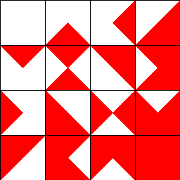
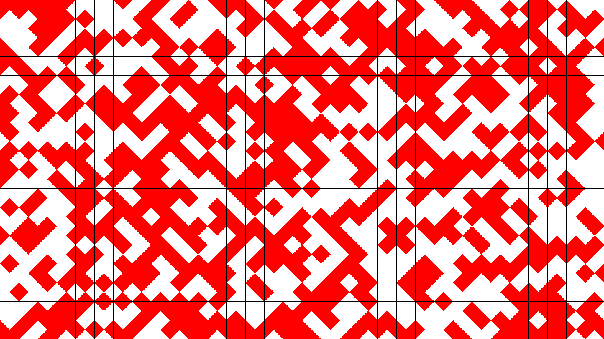

# Wang Tiles in Rust

Welcome to my Rust implementation of Wang Tiles! This project explores procedural generation using Wang tiles, a technique commonly used in computer graphics, texture synthesis, and game development.

The 2-color Wang tiles algorithm involves tiling a plane with square tiles, each having two colored edges. The rule is that adjacent tiles must match their edges' colors. The goal is to find a set of tiles where these matching conditions hold for any arrangement, creating either periodic or aperiodic tiling. Here is an example of tile set:

<div style="text-align: center;">
   
</div>

with which the following image was generated

<div style="text-align: center;">
   
</div>


## References
<a href="https://en.wikipedia.org/wiki/Wang_tile">Wang Tiles (Wikipedia)</a>

<a href="https://www.boristhebrave.com/permanent/24/06/cr31/stagecast/wang/intro.html">Wang Tiles: edge and corner matched tilesets</a>

## Getting Started
### Prerequisites
- <a href="https://www.rust-lang.org/">Rust</a> (latest stable version recommended)

### Quick start
1. Clone the repository:
   ```sh
   git clone https://github.com/guilmont/wang_tiles.git
   cd wang_tiles
   cargo run
   ```

## License
This project is licensed under the MIT License. See `LICENSE` for details.
